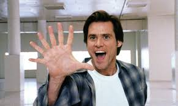

# Videos

[back to table of contents](../README.md)  

GIT:  

[](https://www.youtube.com/watch?v=HkdAHXoRtos)

Same Image as Video above, but lands on different video:  
[](https://www.youtube.com/watch?v=66tfvFeALBQ)


[back to table of contents](../README.md)  

# Checklist

[back to table of contents](../README.md)  


[back to table of contents](../README.md)  


[back to table of contents](../README.md)  


&nbsp;&nbsp;&nbsp;&nbsp;&nbsp;&nbsp;

## Checklist

- [x] Learn how to checklist in Markdown   
- [x] Update checklist
- [ ] [BERF](https://www.roadmap.sh/best-practices/backend-performance)  

## Tables 

https://www.markdownguide.org/extended-syntax/#tables

| Syntax      | Description |
| ----------- | ----------- |
| Header      | Title       |
| Paragraph   | Text        |

| Syntax | Description | Test Text |
| :---   | :---        | :--- |
| `:---` | Centered | T |

| Syntax | Description | Test Text |
| :----: | :----: | :----: |
| `:----:` | Centered | T |

| Syntax | Description | Test Text |
| ---: | ---: | ---: |
| `:----:` | Right | T |


| Syntax      | Description |
| ----------- | ----------- |
| Header      | Title |
| Paragraph   | First paragraph. <br><br> Second paragraph. |


| Syntax      | Description |
| ----------- | ----------- |
| Header      | Title |
| List        | Here's a list! <ul><li>Item one.</li><li>Item two.</li></ul> |

## Code 

```
{
  "firstName": "John",
  "lastName": "Smith",
  "age": 25
}
```

```json
{
  "firstName": "John",
  "lastName": "Smith",
  "age": 25
}
```

## Other 
I need to highlight these ==very important words==.

X^2^


[This is a comment that will be hidden.]: # 

> :warning: **Warning:** Do not push the big red button.  

> :memo: **Note:** Sunrises are beautiful.

> :bulb: **Tip:** Remember to appreciate the little things in life.


<figure>
    
    <figcaption>A single track trail outside of Albuquerque, New Mexico.</figcaption>
</figure>

Copyright (©) — &copy;  
Registered trademark (®) — &reg;  
Trademark (™) — &trade;  
Euro (€) — &euro;  
Left arrow (←) — &larr;  
Up arrow (↑) — &uarr;  
Right arrow (→) — &rarr;  
Down arrow (↓) — &darr;  
Degree (°) — &#176;  
Pi (π) — &#960;  

[back to table of contents](../README.md)  